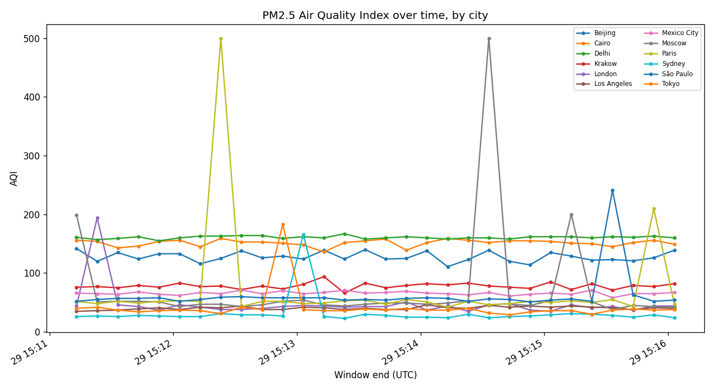
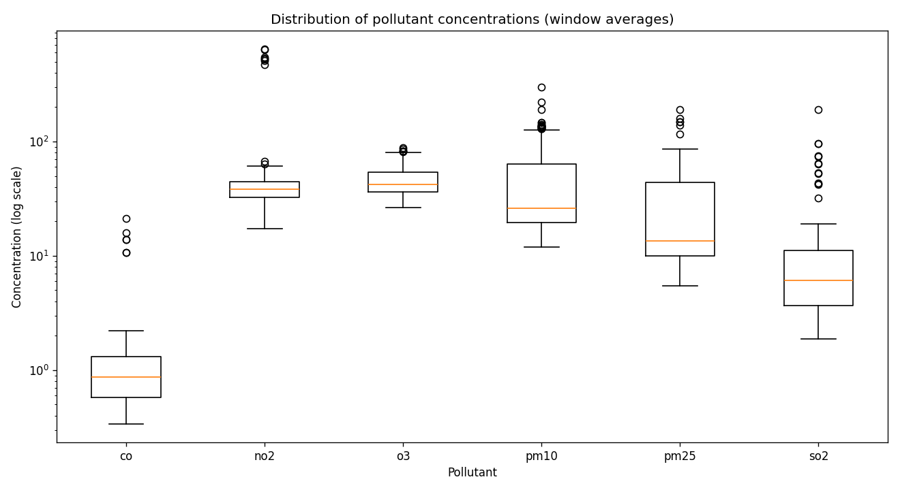
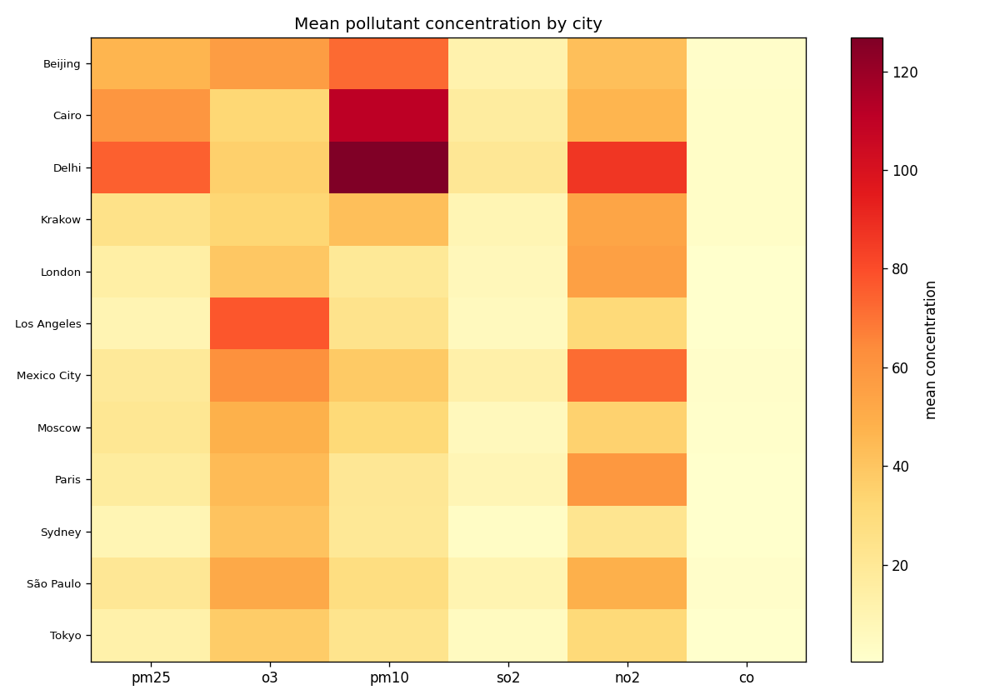
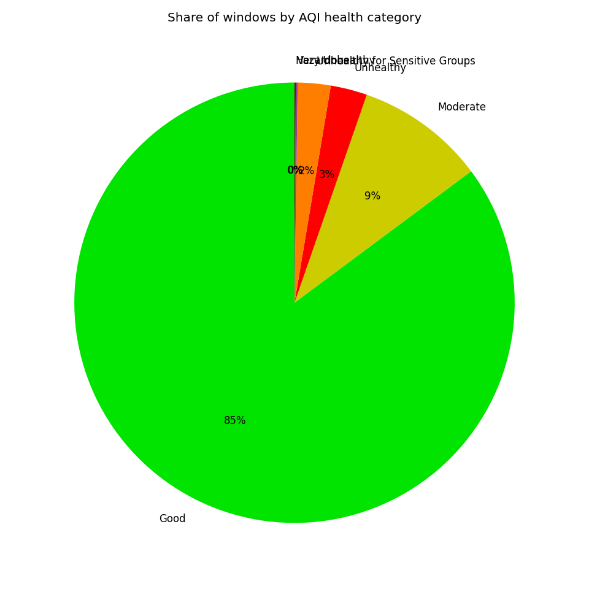

# Отчёт по лабораторной работе №14

## 1. Титульный лист

- **Дисциплина:** Разработка конвейеров обработки данных на Python и Go
- **Лабораторная работа:** №14, повышенный уровень
- **Вариант:** 20 — Мониторинг качества воздуха
- **Источник данных:** OpenAQ API (с офлайн-эмуляцией)

## 2. Техническое задание

Построить конвейер ETL/ELT для мониторинга качества воздуха: Go-сборщик собирает
измерения концентраций загрязнителей по станциям, Python-анализатор обрабатывает
их (Polars, DuckDB, Parquet) и визуализирует. Для повышенного уровня —
распределённый сбор (etcd), оконная агрегация в Go, передача через Apache Arrow,
валидация на Rust, развёртывание в Kubernetes с HPA, потоковая обработка (Kafka),
веб-дашборд реального времени и сравнение производительности Go vs Python.

## 3. Результаты выполнения заданий

Сопоставление заданий и реализации приведено в таблице README. Ключевые
артефакты:

- распределённый сбор с шардированием станций через etcd (rendezvous-хэш);
- tumbling-агрегация в Go с расчётом US EPA AQI;
- три канала выдачи: Kafka, Arrow Flight, Parquet;
- Rust-валидатор, встроенный и в Go (cgo), и в Python (PyO3);
- манифесты Kubernetes с HPA;
- Streamlit-дашборд реального времени.

## 4. Описание архитектуры и компонентов

См. [architecture.md](architecture.md).

## 5. Анализ производительности

### 5.1. Polars vs DuckDB (батч-анализ)

Один и тот же запрос «худшие станции по PM2.5» (фильтр + группировка +
сортировка) на ~2160 агрегатах: Polars ≈ 10 мс, DuckDB ≈ 105 мс. На малых данных
Polars быстрее за счёт отсутствия накладных расходов на инициализацию SQL-движка
и парсинг Parquet «на лету»; преимущество DuckDB проявляется на больших объёмах и
сложных SQL-джойнах.

### 5.2. Go vs Python (сбор)

См. [benchmark.md](benchmark.md). При идентичной нагрузке в режиме насыщения:

Go обеспечивает заметно большую пропускную способность при меньшем потреблении
памяти; Python-версия (asyncio) проще и достаточна для умеренных нагрузок.

### 5.3. Объём передачи

Оконная агрегация в Go снижает объём передаваемых данных в `N` раз (где `N` —
число опросов за окно). Arrow Flight передаёт данные в колоночном бинарном виде
без промежуточного JSON; объём в байтах сравнивается через `scripts/pull_flight.py`.

## 6. Примеры работы и графики

| Временной ряд AQI | Распределение загрязнителей |
|---|---|
|  |  |

| Тепловая карта город×загрязнитель | Категории AQI |
|---|---|
|  |  |

Дашборд реального времени (Streamlit) показывает карту AQI по станциям,
скользящие ряды и разбивку по категориям — обновление по мере поступления данных
из Kafka.

## 7. Выводы

Реализован полный конвейер мониторинга качества воздуха повышенного уровня:
распределённый отказоустойчивый сбор на Go с координацией через etcd, оконная
агрегация, мультиформатная выдача (Kafka/Arrow/Parquet), валидация на Rust с
двумя биндингами, аналитика на Polars/DuckDB, визуализации и real-time дашборд,
а также развёртывание в Docker Compose и Kubernetes с автоскейлингом. Сравнение
показало преимущество Go по пропускной способности и памяти при большей простоте
Python для аналитической части.

## 8. Список использованных источников

- OpenAQ API — https://docs.openaq.org/
- US EPA AQI — https://www.airnow.gov/aqi/aqi-basics/
- Go concurrency — https://go.dev/doc/effective_go#concurrency
- Polars — https://pola.rs/ · DuckDB — https://duckdb.org/
- Apache Arrow / Flight — https://arrow.apache.org/
- etcd — https://etcd.io/ · Kafka — https://kafka.apache.org/
- PyO3 — https://pyo3.rs/ · maturin — https://www.maturin.rs/

## 9. Приложения

Исходный код — каталоги `collector/`, `collector_py/`, `validator/`,
`analyzer/`, `dashboard/`; конфигурация — `docker-compose.yml`, `k8s/`.
