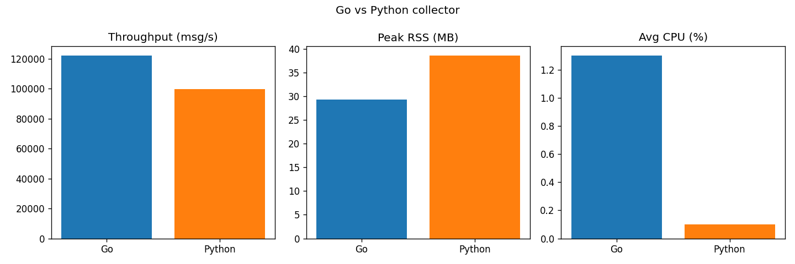

# Go vs Python collector benchmark

Both collectors run the *same* synthetic air-quality workload (12 stations × 6 pollutants), in saturate mode (no poll delay), validating every reading and rolling it into a 5 s tumbling window. Each is launched as a subprocess and sampled with `psutil`; throughput is measurements processed per second, CPU is normalised to a single core.

| Implementation | Throughput (msg/s) | Peak RSS (MB) | Avg CPU (%) |
|---|---:|---:|---:|
| Go | 122158.4 | 29.3 | 1.3 |
| Python | 99785.2 | 38.6 | 0.1 |

Go throughput is 1.2× Python's; Python RSS is 1.3× Go's.

> Note: neither implementation saturates a full core here — the per-message work (synthetic generation + validation + window update) is cheap, so both are bound by scheduling/yield overhead rather than CPU. The headline difference is throughput and memory footprint. Numbers vary by machine; regenerate with `python -m scripts.benchmark`.

